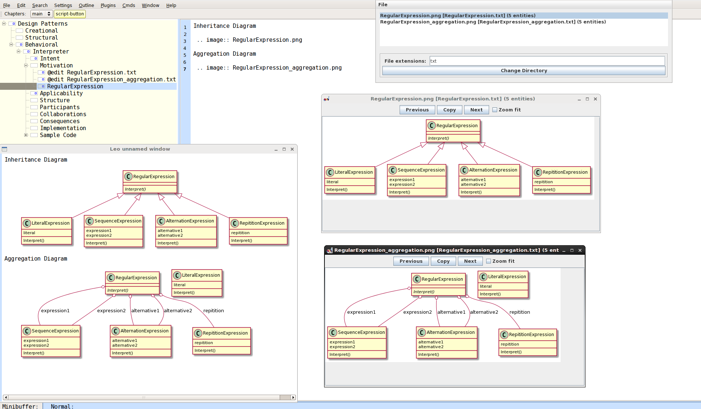

* http://plantuml.com
* https://sourceforge.net/projects/plantuml

1. java -jar plantuml.jar
2. Point to the directory where the uml diagrams will be saved
3. Use Leo to write the plantuml diagram syntax and save the files (@edit nodes work well)
4. As you save files from Leo, the plantuml directory watcher will automatically regenerate the images.
5. You can either click on the image of interest and watch it update OR use Leo's View Rendered widget to view a rst node.

